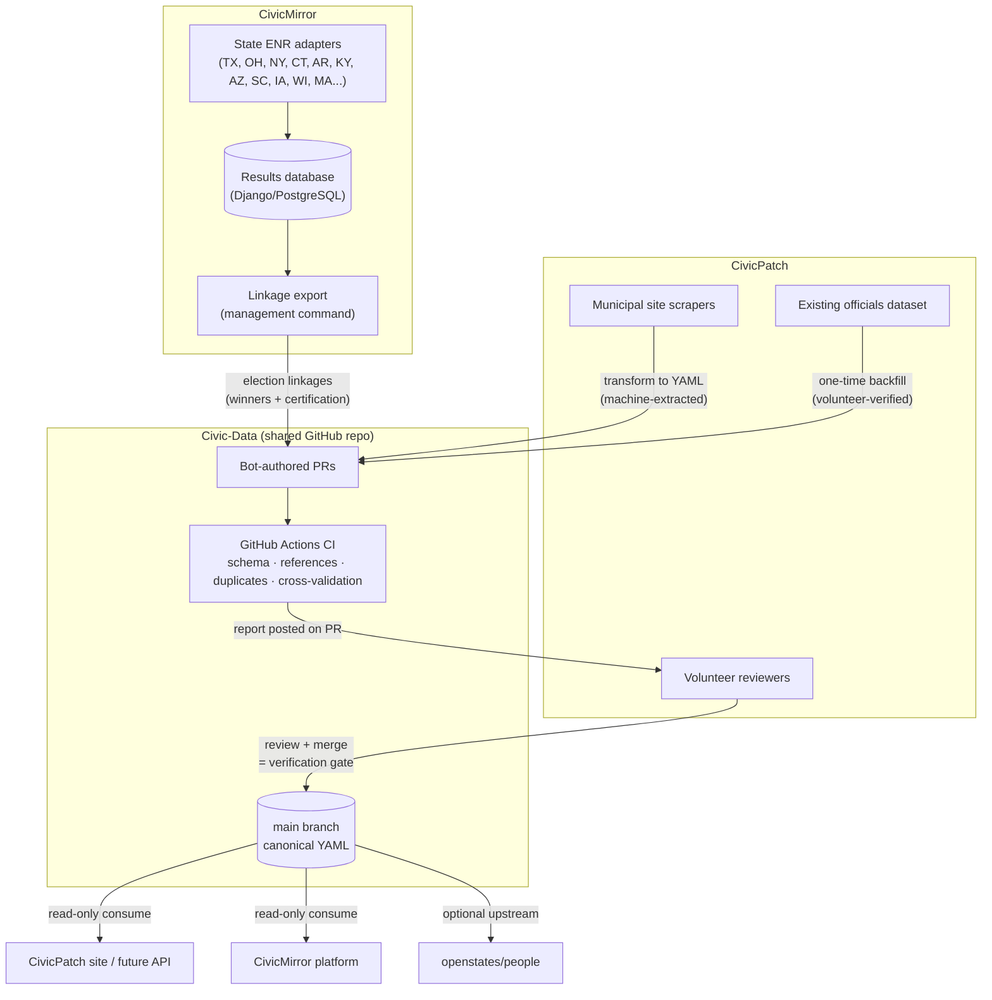

# Data Flow: CivicPatch × CivicMirror × Civic-Data

How data moves between the two source projects and the shared repository — both the one-time backfill and the ongoing steady-state flow.

## The Big Picture



**The key idea:** both projects *write* through pull requests and *read* from `main`. Nothing enters `main` without passing CI and a human merge. The merge itself is the verification event.

## Flow 1 — CivicPatch → Civic-Data (officials & jurisdictions)

### Ongoing (steady state)

```
Municipal website
      │  scraper run (existing CivicPatch tooling)
      ▼
Raw extracted record (name, role, email, phone, url, ward/district)
      │  transform step: map to official.schema.json
      │  - verification.status: machine-extracted
      │  - sources: [{url, retrieved: <date>}]
      ▼
Bot opens PR  ──  one jurisdiction per PR, small & thematic
      │
      ▼
CI runs: schema ✓  refs ✓  dupes ✓  cross-validation vs election linkages
      │  report posted to PR (matches, warnings, conflicts)
      ▼
CivicPatch volunteer reviews the diff  (same review they do today,
      │                                 just on GitHub instead of custom UI)
      ▼
Merge → record lands in main as volunteer-verified
```

### One-time backfill

```
Existing CivicPatch dataset
      │  migration script (run once per state)
      │  - already-verified records keep status: volunteer-verified
      │  - unreviewed records enter as: machine-extracted
      ▼
One PR per state  →  CI  →  spot-check the *conversion*, not each record
      ▼
Merge
```

Records their volunteers already verified don't get re-reviewed — the human review already happened. Reviewers only sanity-check that the format conversion is faithful.

## Flow 2 — CivicMirror → Civic-Data (election linkages)

### Ongoing (steady state)

```
State ENR / certification source
      │  existing CivicMirror adapter ingests full results
      ▼
CivicMirror results DB (full detail: precincts, vote counts, candidates)
      │  Django management command: export_linkages
      │  - winners per contest only (compact)
      │  - certification status
      │  - detail_ref URI → back to full CivicMirror results
      ▼
Bot opens PR  ──  linkage YAML per contest
      ▼
CI + cross-validation:
      - does the winner match a seated official?      → CROSS: name-disagreement
      - is the winner missing from officials?          → CROSS: winner-not-seated
      - is an elected official missing an election?    → CROSS: no-election-trace
      ▼
Review + merge
```

Full election results **never** enter the shared repo — only the compact linkage record. Raw results stay in CivicMirror; `detail_ref` points back to them.

### One-time backfill

```
CivicMirror results DB
      │  same management command, run historically
      │  batched: one PR per state
      ▼
CI  →  review  →  merge
```

The main effort is not the YAML dump — it's **mapping contests to stable office IDs and OCD division IDs**. Budget roughly a weekend for the first state; subsequent states reuse the mapping patterns.

## Flow 3 — The Cross-Validation Loop (where the value is)

```
        officials/*.yml                election-linkages/*.yml
        (CivicPatch data)              (CivicMirror data)
              │                               │
              └──────────┬────────────────────┘
                         ▼
              scripts/validate.py  (runs in CI on every PR,
                         │          or locally by anyone)
                         ▼
        ┌────────────────┼────────────────────┐
        ▼                ▼                    ▼
   ✓ MATCH          ⚠ CROSS WARNING      ✗ ERROR
   winner is        winner-not-seated    schema violation
   seated with      name-disagreement    broken reference
   matching name    no-election-trace    duplicate ID
        │                │                    │
        ▼                ▼                    ▼
   merge freely     human investigates:  CI fails,
                    data error? or       PR blocked
                    resignation /        until fixed
                    appointment /
                    recall? (real-world
                    events are OK —
                    document & merge)
```

**Warnings don't block merges by default** (`--strict` makes them fail) because a mismatch can be a *real-world event* — a resignation, an appointment, a recall — not a data error. Each dataset is the audit trail for the other.

## Who Touches What

| Actor | Writes via | Reads from | Merge rights |
|---|---|---|---|
| CivicPatch scrapers/bot | PRs (machine-extracted) | — | No |
| CivicMirror export bot | PRs (linkages) | — | No |
| CivicPatch volunteers | Manual fix PRs | main | **Yes — the gate** |
| CivicMirror platform | — | main (read-only) | No |
| CivicPatch site / API | — | main (read-only) | No |
| openstates/people | — | optional downstream sync | — |

Bots never merge their own PRs, and bots never emit `volunteer-verified` — that status can only be conferred by a human merge.
